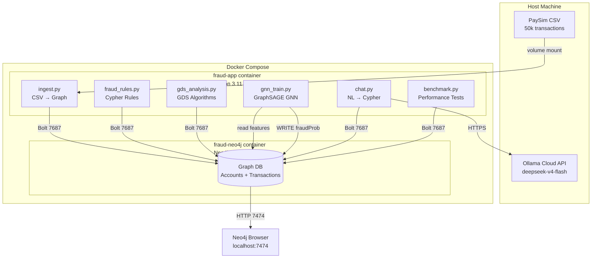
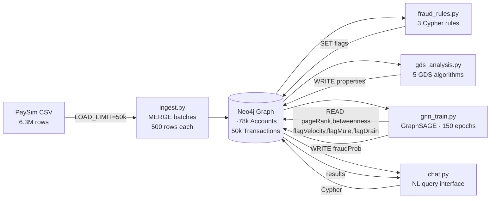
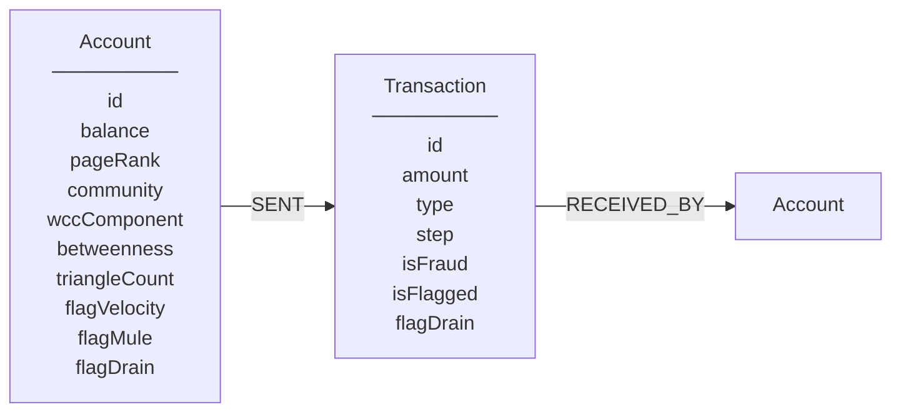
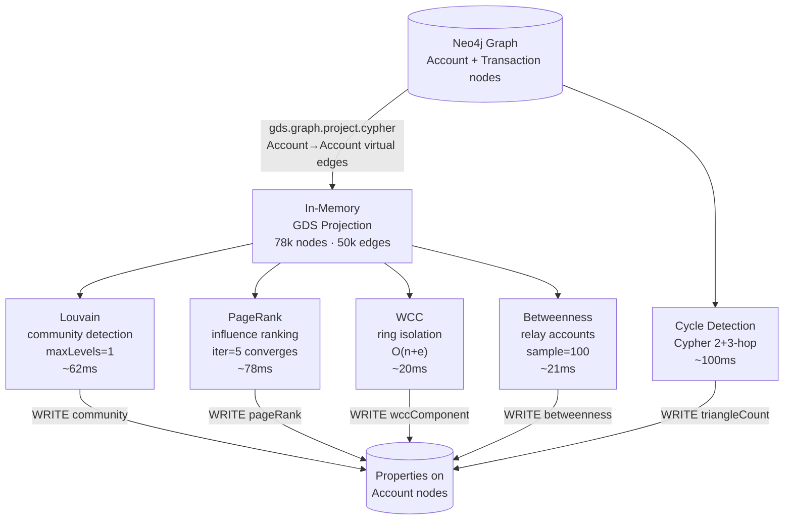
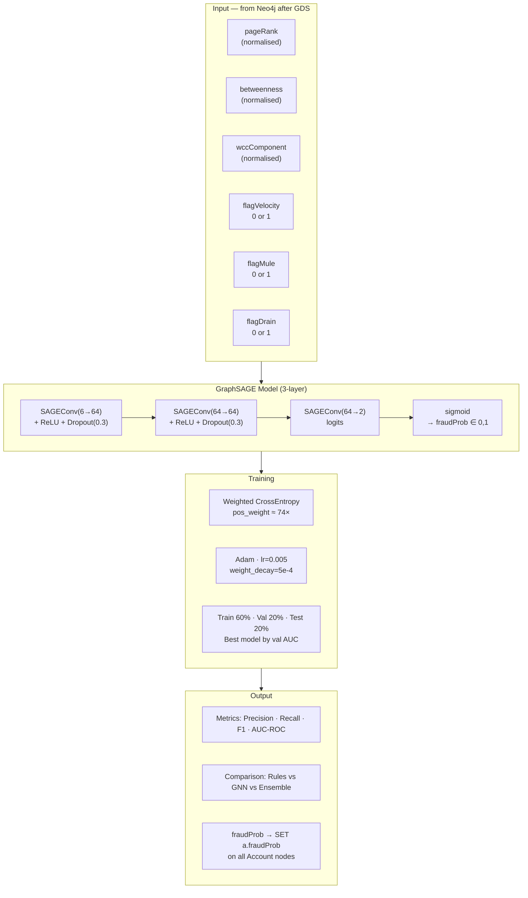
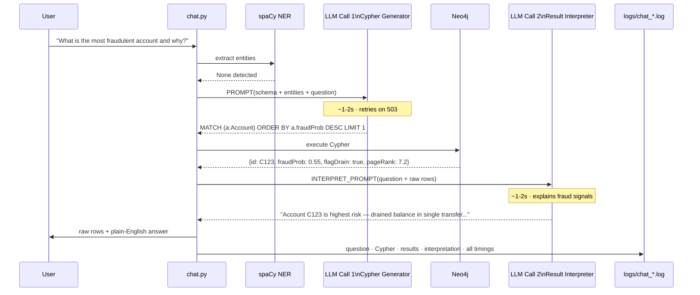
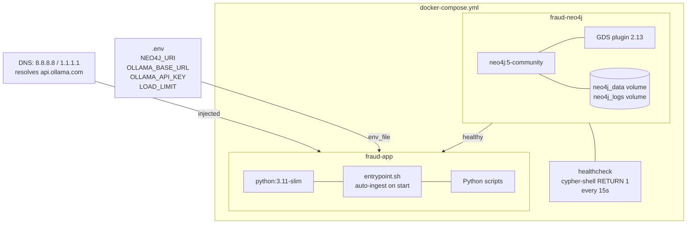

# Architecture — Fraud Graph Demo

End-to-end fraud detection system using Neo4j knowledge graph, GDS algorithms, GraphSAGE GNN, and LLM-powered natural language querying.

---

## System Overview



---

## Data Pipeline



---

## Graph Data Model



**Transaction types:** `PAYMENT` · `TRANSFER` · `CASH_OUT` · `DEBIT` · `CASH_IN`

**Fraud flags written by `fraud_rules.py`:**

| Flag | Rule | Pattern |
|------|------|---------|
| `flagVelocity` | >3 txns within 10 steps | Card-testing / account takeover |
| `flagMule` | On A→B→C→cashout chain | Money mule layering |
| `flagDrain` | Emptied ≥95% balance in one transfer | Smash-and-grab fraud |

**GDS properties written by `gds_analysis.py`:**

| Property | Algorithm | Fraud signal |
|----------|-----------|--------------|
| `community` | Louvain | High-fraud-density clusters |
| `pageRank` | PageRank | Central money-hub accounts |
| `wccComponent` | WCC | Isolated fraud rings |
| `betweenness` | Betweenness Centrality | Bridge / relay accounts |
| `triangleCount` | Cycle Detection (Cypher) | Circular layering flows |

---

## GDS Algorithm Pipeline



---

## GNN Pipeline — GraphSAGE



**Layer behaviour:** Each SAGEConv aggregates features from 1-hop neighbours (mean aggregation), concatenates with the node's own features, and applies a linear transform. After 3 layers, each node's representation encodes its 3-hop neighbourhood — enough to capture the full mule chain structure (A→B→C→cashout).

---

## NL Chat Pipeline

Chat launches automatically after `run_all.py` completes — always, regardless of smoke test result.  
Each session is logged to `logs/chat_YYYY-MM-DD_HH-MM-SS.log` (question · Cypher · results · timing).  
To quit: type `quit` / `exit` / `q`.

Two LangChain chains run per question — Cypher generator + result interpreter:



**Two LangChain chains:**
```python
chain           = PROMPT | llm           # generates Cypher
interpret_chain = INTERPRET_PROMPT | llm # explains results in plain English
```

**Retry logic:** On 503 overloaded — waits 5/10/15s, retries up to 3×. Interpreter failure is non-fatal — raw results still shown.

**Schema exposed to Cypher LLM:**
```
(:Account {id, balance, pageRank, community, wccComponent, betweenness,
           triangleCount, flagVelocity, flagMule, flagDrain, fraudProb})
```

**Flag initialization:** `fraud_rules.py` sets `flagVelocity=false`, `flagMule=false`, `flagDrain=false` on all accounts before running rules — eliminates null values that break boolean filters.

---

## Container Architecture



---

## File Structure

```
fraud-graph-demo/
├── docker-compose.yml        ← two services: neo4j + app
├── .env                      ← secrets (gitignored)
├── .env.example              ← template
├── README.md                 ← setup + test cases
├── ARCHITECTURE.md           ← this file
├── benchmark_report.md       ← generated benchmark results
├── architecture.drawio       ← draw.io diagram
│
├── app/
│   ├── Dockerfile            ← python:3.11-slim + spaCy model
│   ├── entrypoint.sh         ← auto-ingest if DB empty on startup
│   ├── requirements.txt
│   ├── ingest.py             ← PaySim CSV → Neo4j (MERGE batches)
│   ├── fraud_rules.py        ← 3 Cypher fraud detection rules
│   ├── gds_analysis.py       ← 5 GDS algorithms + Cypher cycle detection
│   ├── gnn_train.py          ← GraphSAGE 3-layer · fraudProb → Neo4j
│   ├── chat.py               ← spaCy NER + LangChain + Ollama NL→Cypher + session logging
│   ├── run_all.py            ← full pipeline smoke test (9 checks) + auto-launch chat
│   └── benchmark.py          ← timing benchmark across 4 sizes × 3 configs
│
├── logs/                     ← run evidence (volume-mounted from container)
│   ├── run_YYYY-MM-DD_HH-MM-SS.log   ← full pipeline output
│   └── chat_YYYY-MM-DD_HH-MM-SS.log  ← chat session log
│
└── data/
    └── *.csv                 ← PaySim dataset (gitignored)
```

---

## Key Design Decisions

| Decision | Choice | Reason |
|----------|--------|--------|
| Graph DB | Neo4j 5 community | Native graph traversal, GDS plugin, Bolt protocol |
| Graph projection | Cypher (Account→Account) | Native projection missed Account↔Account edges through Transaction nodes |
| LLM | Ollama Cloud deepseek-v4-flash | Fast inference, no local GPU needed, Ollama API compatible |
| LLM client | Custom `OllamaCloudLLM(LLM)` | `langchain_ollama.OllamaLLM` ignores `base_url`/`headers` params |
| Betweenness | `samplingSize=100` | 142× faster than exact, sufficient for fraud use case |
| Louvain | `maxLevels=1` | Same modularity (0.9999), 5× cheaper |
| PageRank | `maxIterations=5` | Converges in 2 iterations on this graph; higher wastes compute |
| Ingest | MERGE not CREATE | Idempotent — safe to re-run; entrypoint skips if DB already populated |
| Cycle detection | Cypher 2+3-hop instead of GDS triangleCount | GDS triangleCount requires UNDIRECTED projection; money flows are directed |
| GNN model | GraphSAGE over GCN | GraphSAGE is inductive — new accounts scored without retraining; GCN is transductive |
| GNN features | GDS properties + rule flags | Combines structural signals (pageRank, betweenness) with rule-based signals in one feature vector |
| GNN loss | Weighted cross-entropy (pos_weight ≈ 74×) | PaySim fraud rate ~1.3% — without weighting the model ignores the minority class |
| GNN epochs | 150 with best-val-AUC checkpoint | Prevents overfitting; fraud graphs have noisy labels (simulation artefacts) |

---

## Algorithm Design Rationale

### Why Louvain for Community Detection?

Louvain maximises **modularity** — the fraction of edges inside communities minus the expected fraction if edges were placed randomly. Fraud rings have dense internal edges (accounts transact repeatedly within the ring) and few external edges (they avoid legitimate accounts). This structure scores high modularity, making Louvain naturally suited to isolate fraud rings.

Alternatives considered:
- **Label Propagation** — faster but non-deterministic; different runs produce different communities
- **K-Means on embeddings** — requires feature engineering; Louvain works directly on graph structure

### Why PageRank for Coordinator Detection?

In a money-flow graph, PageRank propagates "importance" along transaction edges. Accounts that receive funds from many other accounts accumulate high PageRank — they are the **aggregation points** in the layering chain. Unlike simple degree centrality (count of connections), PageRank weights connections by the importance of the sender, making it robust to accounts that simply have many low-value connections.

### Why WCC for Real-Time Ring Isolation?

WCC runs in **O(n+e)** via union-find. It's the only algorithm in the pipeline that can scale to streaming fraud detection. The insight: legitimate accounts connect to the broad transaction network (thousands of reachable accounts); fraud rings are self-contained subgraphs with limited external connections. WCC assigns all nodes in a connected component the same ID — downstream filtering then flags components where fraud density exceeds a threshold.

### Why Betweenness Sampling?

Exact betweenness requires computing shortest paths between **all pairs of nodes** — O(n·e) for unweighted graphs, O(n·e + n²·log n) for weighted. At 78k nodes this is 4.5 seconds. Approximate betweenness samples a random subset of source nodes (100 here) and extrapolates — **142× faster** with near-identical rankings for the highest-betweenness nodes (which are the fraud signals we care about).

### Why Cypher Cycle Detection instead of GDS triangleCount?

GDS triangle counting requires an UNDIRECTED projection because triangles are symmetric (A-B-C-A is the same as A-C-B-A in an undirected graph). Our Account→Account projection is **directed** — money flows from sender to receiver, not both ways. Projecting as UNDIRECTED would lose the directional information needed to distinguish genuine circular flows from coincidental return payments. Cypher pattern matching on the directed graph is slower (~115ms) but semantically correct.

### Why GraphSAGE for Fraud Node Classification?

**Rules vs GDS vs GNN — three complementary layers:**

| Layer | Mechanism | Catches | Misses |
|-------|-----------|---------|--------|
| Fraud rules (Cypher) | Pattern matching | Known fraud patterns (velocity, mule, drain) | Novel patterns, structural guilt-by-association |
| GDS algorithms | Graph topology metrics | Structural roles (hubs, bridges, rings) | Can't label fraud directly — unsupervised |
| GraphSAGE (GNN) | Learned neighbourhood aggregation | Complex patterns + structural context + known signals together | Patterns outside training distribution |

**Why neighbourhood aggregation matters:**  
A "clean" account (no rule flags, moderate PageRank) that consistently routes money from high-velocity senders to high-drain receivers is structurally suspicious. Rules won't fire. GDS metrics will be moderate. But GraphSAGE, aggregating across 3 hops, sees that its neighbourhood is saturated with fraud signals — and scores it high.

**Why 3 layers / 3 hops?**  
A typical mule chain is 3–4 hops: origin → mule → aggregator → cashout. 3 SAGEConv layers means each node's embedding incorporates information from all accounts within 3 transaction steps — exactly the range needed to see the full layering structure.

**Inductive vs transductive:**  
GCN (Graph Convolutional Network) learns fixed embeddings for each node — it cannot score new nodes without retraining. GraphSAGE learns an *aggregation function* (mean of neighbour features + linear transform). When a new account joins the graph, its embedding is computed on-the-fly from its neighbours' existing features. This is essential for production fraud detection where new accounts appear constantly.

**Class imbalance strategy:**  
PaySim fraud rate ≈ 1.3% (1 fraud in 74 legitimate accounts). Without correction, the model achieves 98.7% accuracy by predicting "clean" for everything. Weighted cross-entropy assigns `pos_weight = 74` to fraud samples — each fraud example counts as much as 74 clean examples in the loss gradient. This forces the model to learn fraud-discriminative features rather than the majority class distribution.

### Graph Projection Design

The raw PaySim graph is **bipartite**: Accounts and Transactions are separate node types connected by `SENT` and `RECEIVED_BY` relationships. GDS community/centrality algorithms are designed for **unipartite** graphs (one node type). The Cypher projection solves this by collapsing each `Account→Transaction→Account` path into a virtual direct `Account→Account` edge:

```
Raw graph:    (src:Account) -[:SENT]-> (tx:Transaction) -[:RECEIVED_BY]-> (dst:Account)
Projected:    (src:Account) ──────────────────────────────────────────────> (dst:Account)
```

Native projection alternative (rejected): mapping `SENT` relationships would give `Account→Transaction` edges — GDS would see Transaction nodes as the neighbours of Account nodes, producing meaningless community assignments.
