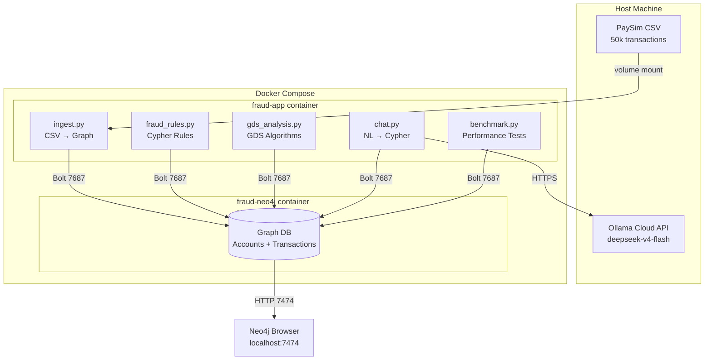
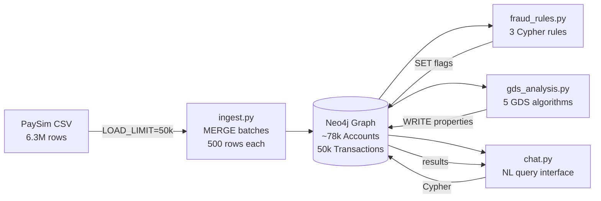
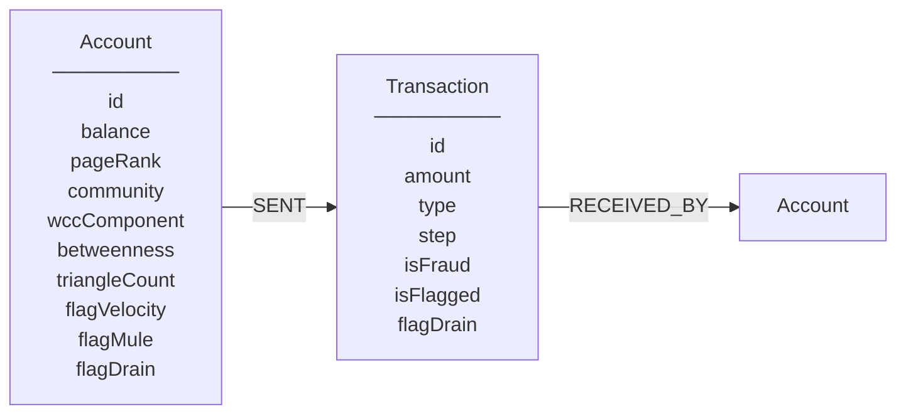
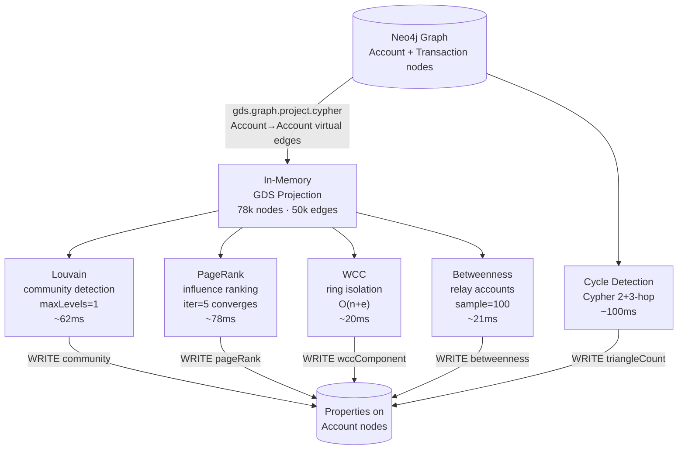
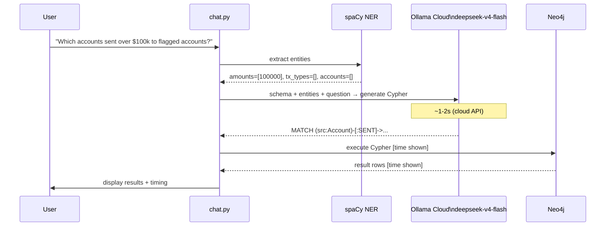
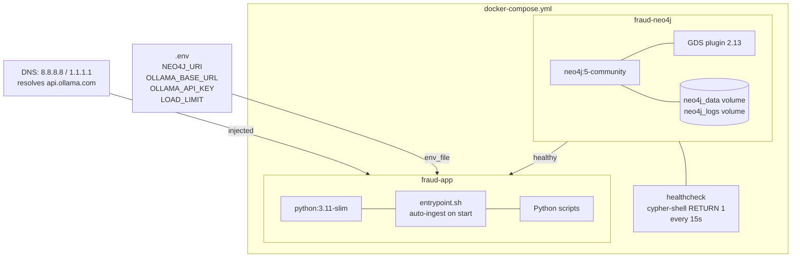

# Architecture — Fraud Graph Demo

End-to-end fraud detection system using Neo4j knowledge graph, GDS algorithms, and LLM-powered natural language querying.

---

## System Overview



---

## Data Pipeline



---

## Graph Data Model



**Transaction types:** `PAYMENT` · `TRANSFER` · `CASH_OUT` · `DEBIT` · `CASH_IN`

**Fraud flags written by `fraud_rules.py`:**

| Flag | Rule | Pattern |
|------|------|---------|
| `flagVelocity` | >3 txns within 10 steps | Card-testing / account takeover |
| `flagMule` | On A→B→C→cashout chain | Money mule layering |
| `flagDrain` | Emptied ≥95% balance in one transfer | Smash-and-grab fraud |

**GDS properties written by `gds_analysis.py`:**

| Property | Algorithm | Fraud signal |
|----------|-----------|--------------|
| `community` | Louvain | High-fraud-density clusters |
| `pageRank` | PageRank | Central money-hub accounts |
| `wccComponent` | WCC | Isolated fraud rings |
| `betweenness` | Betweenness Centrality | Bridge / relay accounts |
| `triangleCount` | Cycle Detection (Cypher) | Circular layering flows |

---

## GDS Algorithm Pipeline



---

## NL Chat Pipeline



---

## Container Architecture



---

## File Structure

```
fraud-graph-demo/
├── docker-compose.yml        ← two services: neo4j + app
├── .env                      ← secrets (gitignored)
├── .env.example              ← template
├── README.md                 ← setup + test cases
├── ARCHITECTURE.md           ← this file
├── benchmark_report.md       ← generated benchmark results
├── architecture.drawio       ← draw.io diagram
│
├── app/
│   ├── Dockerfile            ← python:3.11-slim + spaCy model
│   ├── entrypoint.sh         ← auto-ingest if DB empty on startup
│   ├── requirements.txt
│   ├── ingest.py             ← PaySim CSV → Neo4j (MERGE batches)
│   ├── fraud_rules.py        ← 3 Cypher fraud detection rules
│   ├── gds_analysis.py       ← 5 GDS algorithms + Cypher cycle detection
│   ├── chat.py               ← spaCy NER + LangChain + Ollama NL→Cypher
│   ├── run_all.py            ← full pipeline smoke test (8 checks)
│   └── benchmark.py          ← timing benchmark across 4 sizes × 3 configs
│
└── data/
    └── *.csv                 ← PaySim dataset (gitignored)
```

---

## Key Design Decisions

| Decision | Choice | Reason |
|----------|--------|--------|
| Graph DB | Neo4j 5 community | Native graph traversal, GDS plugin, Bolt protocol |
| Graph projection | Cypher (Account→Account) | Native projection missed Account↔Account edges through Transaction nodes |
| LLM | Ollama Cloud deepseek-v4-flash | Fast inference, no local GPU needed, Ollama API compatible |
| LLM client | Custom `OllamaCloudLLM(LLM)` | `langchain_ollama.OllamaLLM` ignores `base_url`/`headers` params |
| Betweenness | `samplingSize=100` | 142× faster than exact, sufficient for fraud use case |
| Louvain | `maxLevels=1` | Same modularity (0.9999), 5× cheaper |
| PageRank | `maxIterations=5` | Converges in 2 iterations on this graph; higher wastes compute |
| Ingest | MERGE not CREATE | Idempotent — safe to re-run; entrypoint skips if DB already populated |
