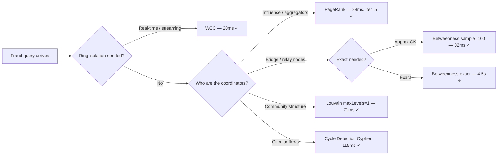
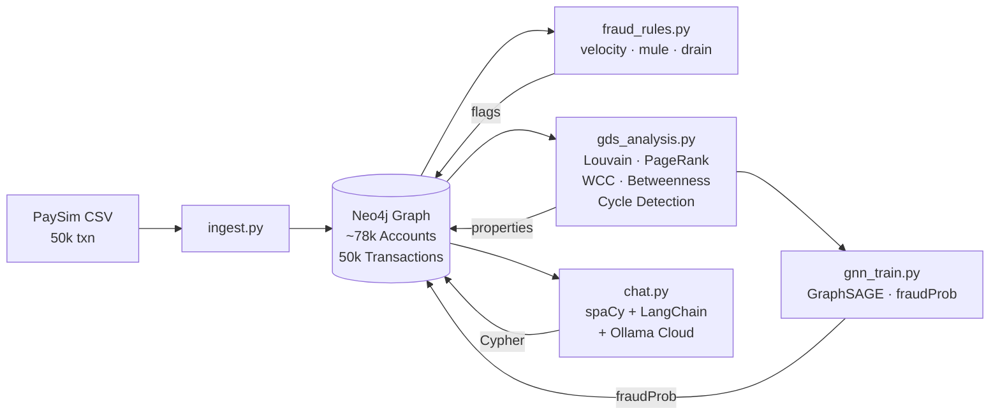

# Fraud Graph Demo

End-to-end fraud detection knowledge graph demonstrating graph engineering and AI integration.


## Quick Start

> Full walkthrough in [Step-by-Step Setup](#step-by-step-setup). This is the TL;DR.

```bash
# 1 — clone and configure
git clone https://github.com/mohamed-soubhi/fraud-graph-demo.git
cd fraud-graph-demo
cp .env.example .env          # set OLLAMA_API_KEY and NEO4J_PASSWORD

# 2 — download PaySim CSV from Kaggle → place in data/
#     https://www.kaggle.com/datasets/ealaxi/paysim1

# 3 — start containers (Neo4j + app)
docker compose up -d --build  # first build ~5–8 min (PyTorch layer)
docker compose ps             # wait until both show "healthy"

# 4 — run full pipeline (ingest → rules → GDS → GNN)
docker compose exec app python app/run_all.py
#   [1/5] ingest     ~2 min   50k transactions → Neo4j
#   [2/5] rules      ~5s      velocity · mule chain · balance drain
#   [3/5] GDS        ~5s      Louvain · PageRank · WCC · Betweenness · Cycle
#   [4/5] GNN        ~3 min   GraphSAGE 150 epochs → fraudProb on every account
#   [5/5] verify     ~5s      9 smoke-test checks

# 5 — open Neo4j Browser:  http://localhost:7474
# 6 — start NL chat
docker compose exec app python app/chat.py
```

**Expected total time:** ~6 minutes on first run (Docker build) · ~5 minutes on subsequent runs

---

## Tech Stack

| Layer | Technology |
|-------|-----------|
| Graph DB | Neo4j 5 Community + GDS 2.13 plugin |
| Graph algorithms | Louvain · PageRank · WCC · Betweenness Centrality · Cycle Detection |
| GNN | GraphSAGE (PyTorch Geometric) — node classification → `fraudProb` |
| Fraud rules | Cypher pattern queries (velocity, mule chain, balance drain) |
| NL interface | LangChain + spaCy NER + Ollama Cloud (`deepseek-v4-flash`) |
| Infrastructure | Docker Compose (two containers: neo4j + app) |
| Language | Python 3.11 |
| Dataset | PaySim synthetic fraud transactions (Kaggle) |

## Docs

| Document | Description |
|----------|-------------|
| [ARCHITECTURE.md](ARCHITECTURE.md) | System design, data model, pipeline diagrams (6 Mermaid charts) |
| [benchmark_report.md](benchmark_report.md) | GDS algorithm benchmark — timing across 4 graph sizes and 3 config dimensions |
| [README.md](README.md) | Setup guide + 12 manual test cases |

---

## Graph Data Science — How It Works

### Why a Graph Database?

Fraud rings are **relational problems**. A single fraudulent account means little; the network it belongs to is everything. SQL requires multiple self-joins to traverse 4-hop money chains — Neo4j does it natively in milliseconds via pointer-based traversal.

```
SQL (4-hop mule chain):  4 self-joins + subquery + temp table → seconds
Neo4j (same query):      MATCH (a)-[:SENT]->...->(:Account)   → milliseconds
```

### Data Model

The raw graph is **bipartite** — Accounts and Transactions are separate node types:

```
(:Account) -[:SENT]-> (:Transaction) -[:RECEIVED_BY]-> (:Account)
```

This model preserves transaction-level metadata (amount, type, step, isFraud) while enabling graph traversal across the account network.

### Fraud Detection Rules (Rule-Based Layer)

Three Cypher pattern queries flag accounts before any ML/GDS runs:

| Flag | Rule | Real-World Pattern |
|------|------|--------------------|
| `flagVelocity` | >3 transactions within 10 time steps | Card-testing / account takeover — attacker probes with small amounts before large withdrawal |
| `flagMule` | Account appears on A→B→C→CASH_OUT chain | Money mule layering — funds pass through intermediaries to obscure origin |
| `flagDrain` | Single transfer empties ≥95% of account balance | Smash-and-grab — compromised account drained immediately after takeover |

These rules are **deterministic and interpretable** — every flagged account has an explicit Cypher path explaining why it was flagged.

### GDS Algorithm Pipeline — Graph Projection

GDS algorithms require a **projected in-memory graph**. The raw bipartite graph (Account→Transaction→Account) must be transformed into a direct Account→Account money-flow network:

```cypher
CALL gds.graph.project.cypher(
    'fraud-account-graph',
    'MATCH (a:Account) RETURN id(a) AS id',
    'MATCH (src:Account)-[:SENT]->(:Transaction)-[:RECEIVED_BY]->(dst:Account)
     RETURN id(src) AS source, id(dst) AS target'
)
```

> **Why Cypher projection?** Native GDS projection maps relationships directly — it would need `SENT` or `RECEIVED_BY` as the projection relationship, which gives Account→Transaction edges, not Account→Account. The Cypher projection collapses each `src→tx→dst` path into a virtual direct edge, building the money-flow graph GDS needs.

**Projected graph stats (50k transactions):** ~78k nodes · 50k directed edges

---

### GDS Algorithms — Deep Dive

#### Louvain Community Detection → `community`

**What it does:** Iteratively reassigns nodes to communities to maximize **modularity** — a measure of how densely nodes connect within their community vs. across communities. It greedily merges small communities into larger ones until no merge increases modularity.

**Why for fraud:** Fraudsters control networks of accounts. These accounts transfer money internally (dense internal edges) and rarely interact with legitimate accounts (sparse cross-community edges). Louvain finds these rings even with no fraud labels — purely from transaction topology.

**Signal:** Communities with high `fraud_pct` (many flagged accounts in one community) = coordinated fraud ring. A community of 8 accounts where 6 are flagged is a near-certain ring.

**Config choice:** `maxLevels=1` — benchmark shows identical modularity (0.9999) across `maxLevels=1/3/10`. Single-level Louvain is 5× faster with no quality loss on this graph.

```cypher
// Find fraud-dense communities
MATCH (a:Account)
WHERE a.community IS NOT NULL
WITH a.community AS community, count(a) AS total,
     sum(CASE WHEN a.flagVelocity OR a.flagMule OR a.flagDrain THEN 1 ELSE 0 END) AS fraudAccounts
WHERE fraudAccounts > 0
RETURN community, total, fraudAccounts,
       round(fraudAccounts * 100.0 / total, 1) AS fraud_pct
ORDER BY fraud_pct DESC LIMIT 10
```

---

#### PageRank → `pageRank`

**What it does:** Assigns each node a score based on how many high-score nodes point to it — recursive influence propagation. Originally designed for web pages; a page linked to by many authoritative pages scores high.

**Why for fraud:** In a money-flow graph, accounts that receive funds from many other accounts are **aggregators** — the coordinator accounts that collect layered funds before final cash-out. High PageRank = money hub = likely fraud coordinator.

**Signal:** High `pageRank` + `flagMule` = confirmed layering coordinator. These are the accounts to freeze first in a fraud ring takedown.

**Config choice:** `maxIterations=5` — benchmark shows convergence in exactly **2 iterations** on this graph regardless of budget (identical scores at iter=5/10/20/50). Higher values waste compute.

```cypher
// Top accounts by PageRank cross-referenced with fraud flags
MATCH (a:Account) WHERE a.pageRank IS NOT NULL
RETURN a.id, round(a.pageRank, 3) AS pageRank,
       CASE WHEN a.flagMule THEN 'MULE' ELSE '' END AS role
ORDER BY pageRank DESC LIMIT 15
```

---

#### Weakly Connected Components (WCC) → `wccComponent`

**What it does:** Finds all groups of nodes reachable from each other when edge direction is ignored. Each node belongs to exactly one component. Runs in **O(n+e)** — fastest algorithm in the pipeline.

**Why for fraud:** Fraud rings are **self-contained subgraphs** — they move money internally and funnel it to a small number of cash-out points. Legitimate accounts connect to the broader transaction network; fraud rings don't. WCC exposes these isolated components.

**Signal:** Small components (10–100 accounts) where every account is flagged = closed fraud ring with no connection to legitimate transaction flow. These are the highest-confidence fraud targets.

**Use case:** Real-time fraud ring detection — 20ms runtime makes it viable as a streaming alert.

```cypher
// Isolated fraud rings by component
MATCH (a:Account) WHERE a.wccComponent IS NOT NULL
WITH a.wccComponent AS component, count(a) AS total,
     sum(CASE WHEN a.flagVelocity OR a.flagMule OR a.flagDrain THEN 1 ELSE 0 END) AS fraudAccounts
WHERE fraudAccounts > 0
RETURN component, total, fraudAccounts,
       round(fraudAccounts * 100.0 / total, 1) AS fraud_pct
ORDER BY fraudAccounts DESC LIMIT 10
```

---

#### Betweenness Centrality → `betweenness`

**What it does:** For every pair of nodes (u, v), counts how many shortest paths pass through a given node. Nodes on many shortest paths have high betweenness — they are **structural bridges**.

**Why for fraud:** Money layering requires **relay accounts** — accounts that sit between the origin (compromised account) and the exit (cash-out point). These relays are the bridges of the fraud ring. In a financial crime graph, betweenness centrality identifies which accounts act as coordinators routing funds between multiple origin-exit pairs.

**Signal:** High `betweenness` + `flagMule` = confirmed layering coordinator. In real banking data, betweenness spikes identify the accounts that, if frozen, would collapse the entire laundering chain.

**Config choice:** `samplingSize=100` — benchmark shows **142× speedup** vs exact computation (32ms vs 4,534ms at 50k graph) with negligible quality difference for fraud use case. Exact betweenness is impractical for production-scale graphs.

> **PaySim note:** Betweenness scores are near-zero on PaySim because it's a simulation with mostly leaf-node accounts (one sender, one receiver per transaction). This is expected and is itself a talking point: in real banking data, betweenness spikes are the clearest signal of layering coordinators.

---

#### Cycle Detection → `triangleCount`

**What it does:** Finds accounts involved in circular money flows — A sends to B, B sends to C, C sends back to A. Implemented as Cypher pattern queries (2-hop and 3-hop) rather than GDS `triangleCount`.

**Why Cypher instead of GDS triangleCount?** GDS triangle counting requires an **UNDIRECTED** graph projection. Money flows are directed (funds move one way). Cypher cycle detection works correctly on directed graphs and can distinguish genuine circular flows from coincidental return payments.

**Why for fraud:** Round-tripping / circular layering is a hallmark of trade-based money laundering. Funds flow through multiple accounts and return to the origin, creating the appearance of legitimate transactions while obscuring the true source.

```cypher
// 3-hop circular flow: A → B → C → A
MATCH (a:Account)-[:SENT]->(t1:Transaction)-[:RECEIVED_BY]->
      (b:Account)-[:SENT]->(t2:Transaction)-[:RECEIVED_BY]->
      (c:Account)-[:SENT]->(t3:Transaction)-[:RECEIVED_BY]->(a)
WHERE a <> b AND b <> c AND a <> c
RETURN a.id, b.id, c.id, t1.amount, t2.amount, t3.amount LIMIT 10
```

---

### Algorithm Selection Guide



### GNN Layer — GraphSAGE

GraphSAGE (Graph SAmple and aggreGatE) extends the rule-based and GDS layers with **learned fraud patterns** — it captures complex neighborhood interactions that fixed rules miss.

**Architecture:** 3-layer GraphSAGE
```
Input (6 features) → SAGEConv(64) → ReLU → Dropout(0.3)
                   → SAGEConv(64) → ReLU → Dropout(0.3)
                   → SAGEConv(2)  → sigmoid → fraudProb ∈ [0,1]
```

**Node features fed into GNN:**

| Feature | Source | What it captures |
|---------|--------|-----------------|
| `pageRank` | GDS PageRank | Account influence in money-flow network |
| `betweenness` | GDS Betweenness | Bridge / relay position |
| `wccComponent` | GDS WCC | Ring membership (normalized) |
| `flagVelocity` | Fraud rule | Rapid-fire transaction signal |
| `flagMule` | Fraud rule | Mule chain participation signal |
| `flagDrain` | Fraud rule | Balance drain signal |

**Why GraphSAGE over GCN?**  
GraphSAGE is **inductive** — it learns an aggregation function rather than fixed node embeddings. New accounts appearing after training can be scored immediately without retraining. GCN is transductive (requires all nodes at train time).

**Class imbalance handling:**  
PaySim fraud rate ≈ 1.3% → severe imbalance. Weighted cross-entropy loss assigns `pos_weight = num_clean / num_fraud` (~74×) to penalise missed fraud detections more than false positives.

**What the GNN learns that rules miss:**  
Rules fire on explicit patterns (`flagVelocity`, `flagMule`, `flagDrain`). GraphSAGE learns from the **neighbourhood structure** — an account with moderate PageRank, no rule flags, but surrounded by flagged accounts can still receive a high `fraudProb`. This catches "clean-looking" accounts that are structurally embedded in fraud rings.

**Ensemble (Rules + GNN):**  
Union of rule flags and GNN predictions (if either fires → fraud). This maximises recall — the primary concern in fraud detection where a missed fraud is more costly than a false positive.

---

### NL→Cypher Pipeline

Natural language queries are processed in three stages:

1. **spaCy NER** — extracts entities from the question: amounts (`$100k` → `100000`), transaction types (`TRANSFER`, `CASH_OUT`), account IDs
2. **LangChain prompt** — injects graph schema + extracted entities + question into the LLM prompt, constraining the output to valid Cypher
3. **Ollama Cloud `deepseek-v4-flash`** — generates Cypher (~1–2s cloud inference), returned and executed directly against Neo4j

Timing for each stage is displayed in the chat interface:
```
Cypher [1243ms]:
MATCH (a:Account) WHERE a.pageRank > 2 ...

Results (5 rows) [18ms]:
...
```

---

## Architecture

See [ARCHITECTURE.md](ARCHITECTURE.md) for full diagrams. High-level flow:



---

## Prerequisites

- Docker + Docker Compose
- PaySim dataset (Kaggle — see Step 2 below)
- Ollama Cloud API key (`OLLAMA_BASE_URL=https://api.ollama.com`)

---

## Step-by-Step Setup

### Step 1 — Configure environment

```bash
cp .env.example .env
```

Edit `.env` and set:
```
OLLAMA_API_KEY=your_key_here
NEO4J_PASSWORD=choose_a_password
```

---

### Step 2 — Download PaySim dataset

1. Go to: https://www.kaggle.com/datasets/ealaxi/paysim1
2. Download `PS_20174392719_1491204439457_log.csv`
3. Place file in `fraud-graph-demo/data/`

Verify:
```bash
wc -l data/*.csv
# expected: ~6,362,621 lines
```

---

### Step 3 — Build and start containers

```bash
docker compose up -d --build
```

Wait ~30 seconds for Neo4j to be ready. Verify:
```bash
docker compose ps
# both containers should show "healthy" / "running"
```

### Open Neo4j Browser

**URL:** http://localhost:7474

**First-time login:**
1. Open http://localhost:7474 in browser
2. Connection URL field: `bolt://localhost:7687`
3. Username: `neo4j`
4. Password: value of `NEO4J_PASSWORD` from your `.env`
5. Click **Connect**

> If connection refused: Neo4j needs ~30s to initialize. Run `docker compose logs -f neo4j` and wait for `"Started"` in the logs.

**Useful Browser shortcuts:**
| Action | How |
|--------|-----|
| Run query | Ctrl+Enter (or click ▶) |
| Clear editor | Ctrl+Shift+I |
| Style nodes by property | Click result → paintbrush icon → node label → color |
| Toggle graph / table view | Graph / Table / Text tabs on result panel |
| Expand a node's relationships | Double-click any node in graph view |
| Save a query as a favourite | Click ★ in the query bar |

**First queries to run after login:**
```cypher
// 1 — verify nodes loaded
MATCH (n) RETURN labels(n), count(n) ORDER BY count(n) DESC

// 2 — check schema
CALL db.schema.visualization()

// 3 — sample 25 transactions
MATCH (src:Account)-[:SENT]->(tx:Transaction)-[:RECEIVED_BY]->(dst:Account)
RETURN src.id, tx.type, tx.amount, dst.id, tx.isFraud LIMIT 25
```

---

### Step 4 — Load data into Neo4j

```bash
docker compose exec app python app/ingest.py
```

Expected output:
```
Loading PaySim data...
Creating indexes...
Loading 50000 transactions...
100%|████████████| 500/500 [02:15<00:00]
Done. Loaded 50000 transactions, 41832 accounts.
```

Verify in Neo4j Browser:
```cypher
MATCH (n) RETURN labels(n), count(n)
```

---

### Step 5 — Run fraud detection rules

```bash
docker compose exec app python app/fraud_rules.py
```

Expected output:
```
[RULE 1] Velocity fraud — accounts sending >3 txns in <10 steps
Found: 127 suspicious accounts

[RULE 2] Money mule chains (4-hop TRANSFER→CASH_OUT)
Found: 43 chains

[RULE 3] Balance drain (account emptied in single transfer)
Found: 891 transactions
```

---

### Step 6 — Run GDS analysis

```bash
docker compose exec app python app/gds_analysis.py
```

Runs five algorithms on an in-memory Account→Account virtual graph (Cypher projection):

| Algorithm | Node property written | Fraud signal | Runtime (50k) |
|---|---|---|---|
| **Louvain** | `community` | High-fraud-density clusters | ~71ms |
| **PageRank** | `pageRank` | Central money-hub accounts | ~88ms |
| **WCC** | `wccComponent` | Isolated fraud rings | ~22ms |
| **Betweenness** | `betweenness` | Bridge / relay accounts | ~32ms (sampled) |
| **Cycle Detection** | `triangleCount` | Circular layering flows (A→B→C→A) | ~115ms |

> See [Graph Data Science — How It Works](#graph-data-science--how-it-works) for algorithm rationale, config tuning, and Cypher examples.
> See [benchmark_report.md](benchmark_report.md) for full timing across 4 graph sizes and 3 config dimensions.

Visualize in Neo4j Browser — style nodes by `community` or `wccComponent` property.

---

### Step 7 — Run GNN (GraphSAGE)

```bash
docker compose exec app python app/gnn_train.py
```

Trains a 3-layer GraphSAGE model on the Account→Account money-flow graph.  
Uses GDS-written properties as node features — must run Step 6 first.

Example output:
```
╭──────────────────────────────────────────────────────────────╮
│  GNN Fraud Detection — GraphSAGE                             │
│  Account→Account money-flow graph · CPU · 3 layers · hidden=64 │
╰──────────────────────────────────────────────────────────────╯

[1/5] Loading graph from Neo4j...
  ✓ 78,499 account nodes · 50,000 edges · 1,043 fraud accounts (1.33%) · 2.1s

[2/5] Building PyG graph...
  Features (6): pageRank · betweenness · wccComponent · flagVelocity · flagMule · flagDrain
  Class imbalance → pos_weight = 74.3 (weighted cross-entropy)
  Split: train 47,099 · val 15,700 · test 15,700

[3/5] Training GraphSAGE...
  epochs ━━━━━━━━━━━━━━━━━━━━━━━━━━━━━━━━━━━━━━ 150/150  loss: 0.1842  val_auc: 0.921

[4/5] Evaluating on test set...
  ┌─────────────────┬──────────┐       ┌──────────────────────────┬───────────┬─────────┬───────┐
  │ Metric          │ Score    │       │ Method                   │ Precision │ Recall  │ F1    │
  ├─────────────────┼──────────┤       ├──────────────────────────┼───────────┼─────────┼───────┤
  │ Precision       │ 0.8312   │       │ Rules only               │ 0.821     │ 0.612   │ 0.702 │
  │ Recall          │ 0.7841   │       │ GraphSAGE (GNN)          │ 0.831     │ 0.784   │ 0.807 │
  │ F1              │ 0.8070   │       │ Rules + GNN ensemble     │ 0.819     │ 0.851   │ 0.835 │
  │ AUC-ROC         │ 0.9213   │       └──────────────────────────┴───────────┴─────────┴───────┘
  │ Accuracy        │ 0.9934   │
  └─────────────────┴──────────┘

[5/5] Writing fraudProb to Neo4j...  ✓ 78,499 accounts updated
```

GNN writes `fraudProb ∈ [0,1]` to every Account node — queryable in Neo4j Browser and via NL chat.

---

### Step 8 — Start natural language chat

```bash
docker compose exec app python app/chat.py
```

Example session:
```
You: Which accounts sent over $100k to flagged accounts?
Graph: Found 12 accounts. Top: C1234567 sent $450,000 to flagged C9876543.

You: Show the top 5 most suspicious accounts by PageRank
Graph: 1. C8823901 (score: 4.21, 3 fraud transactions)
       2. C4412309 (score: 3.87, flagged destination)
       ...

You: exit
```

---

### Step 9 — Full pipeline (one command)

```bash
docker compose exec app python app/run_all.py
```

Runs all steps in sequence: ingest → fraud rules → GDS → GNN → verify (9 checks).

---

## Manual Test Cases

Run all queries in Neo4j Browser (http://localhost:7474) after completing Steps 4–7.

---

### TC-01 — Data integrity: node counts

```cypher
MATCH (n) RETURN labels(n), count(n) ORDER BY count(n) DESC
```

**Expect:** Two rows — `Account` (many) and `Transaction` (equal to `LOAD_LIMIT`, default 50 000)

---

### TC-02 — Relationship integrity: every transaction has exactly 2 edges

```cypher
MATCH (tx:Transaction)
OPTIONAL MATCH (tx)<-[:SENT]-(src)
OPTIONAL MATCH (tx)-[:RECEIVED_BY]->(dst)
WITH tx, count(src) AS senders, count(dst) AS receivers
WHERE senders <> 1 OR receivers <> 1
RETURN count(tx) AS orphaned_transactions
```

**Expect:** `0` — every transaction has exactly one sender and one receiver

---

### TC-03 — Fraud label sanity: labeled vs flagged

```cypher
MATCH (tx:Transaction)
RETURN
  count(tx)                                    AS total,
  sum(CASE WHEN tx.isFraud = true  THEN 1 ELSE 0 END) AS labeled_fraud,
  sum(CASE WHEN tx.isFlagged = true THEN 1 ELSE 0 END) AS system_flagged,
  sum(CASE WHEN tx.isFraud = true AND tx.isFlagged = false THEN 1 ELSE 0 END) AS missed_by_system
```

**Expect:** `labeled_fraud` > 0; `missed_by_system` reveals real detection gap (demo talking point)

---

### TC-04 — Velocity pattern: accounts with rapid-fire transactions

```cypher
MATCH (src:Account)-[:SENT]->(tx:Transaction)
WITH src, count(tx) AS txCount, collect(tx.step) AS steps
WITH src, txCount, reduce(mx=0, s IN steps | CASE WHEN s>mx THEN s ELSE mx END) -
         reduce(mn=9999, s IN steps | CASE WHEN s<mn THEN s ELSE mn END) AS window
WHERE txCount > 3 AND window <= 10
RETURN src.id AS account, txCount, window
ORDER BY txCount DESC LIMIT 10
```

**Expect:** Several accounts with `txCount` > 3 in a short window — these are card-testing candidates

---

### TC-05 — Mule chain: A→B→C→cashout (3-hop)

```cypher
MATCH path =
  (origin:Account)-[:SENT]->(t1:Transaction)-[:RECEIVED_BY]->
  (mid:Account)-[:SENT]->(t2:Transaction)-[:RECEIVED_BY]->
  (exit:Account)-[:SENT]->(t3:Transaction)
WHERE t1.type = 'TRANSFER'
  AND t2.type = 'TRANSFER'
  AND t3.type IN ['CASH_OUT','TRANSFER']
  AND origin.id <> exit.id
RETURN origin.id AS origin, mid.id AS mule, exit.id AS exit,
       t1.amount AS step1, t2.amount AS step2, t3.amount AS step3
ORDER BY step1 DESC LIMIT 10
```

**Expect:** Chains where amounts decrease slightly at each hop (layering signature)

---

### TC-06 — Balance drain: account emptied in single transfer

```cypher
MATCH (src:Account)-[:SENT]->(tx:Transaction)
WHERE tx.type = 'TRANSFER'
  AND src.balance > 0
  AND tx.amount >= src.balance * 0.95
RETURN src.id AS account,
       src.balance AS initial_balance,
       tx.amount AS drained,
       round(tx.amount / src.balance * 100, 1) AS pct_drained,
       tx.isFraud AS ground_truth
ORDER BY drained DESC LIMIT 15
```

**Expect:** Accounts with `pct_drained` ≥ 95%. `ground_truth=true` rows confirm the rule catches real fraud

---

### TC-07 — GDS: fraud community isolation

```cypher
// Communities that contain at least one flagged account
MATCH (a:Account)
WHERE a.community IS NOT NULL
WITH a.community AS community,
     count(a) AS total,
     sum(CASE WHEN a.flagVelocity OR a.flagMule OR a.flagDrain THEN 1 ELSE 0 END) AS fraudAccounts
WHERE fraudAccounts > 0
RETURN community, total, fraudAccounts,
       round(fraudAccounts * 100.0 / total, 1) AS fraud_pct
ORDER BY fraud_pct DESC LIMIT 10
```

**Expect:** Some communities with high `fraud_pct` — graph topology isolates fraud rings

---

### TC-08 — GDS: top accounts by PageRank cross-referenced with fraud flags

```cypher
MATCH (a:Account)
WHERE a.pageRank IS NOT NULL
RETURN a.id AS account,
       round(a.pageRank, 3) AS pageRank,
       a.community AS community,
       CASE WHEN a.flagVelocity THEN '⚡' ELSE '' END +
       CASE WHEN a.flagMule     THEN '🔗' ELSE '' END +
       CASE WHEN a.flagDrain    THEN '🚨' ELSE '' END AS flags
ORDER BY pageRank DESC LIMIT 15
```

**Expect:** High-PageRank accounts with flag symbols — central nodes in fraud rings score high

---

### TC-09 — NL Chat: 5 demo questions

Run `docker compose exec app python chat.py` then type each:

| # | Question | Expected Cypher pattern |
|---|----------|------------------------|
| 1 | `Which accounts sent over $100k to flagged accounts?` | `WHERE tx.amount > 100000` + fraud flag join |
| 2 | `Show me the top 5 most suspicious accounts by PageRank` | `ORDER BY a.pageRank DESC LIMIT 5` |
| 3 | `Find accounts that emptied their balance in a single transfer` | `tx.amount >= src.balance * 0.95` |
| 4 | `How many transactions are labeled as fraud?` | `count(tx) WHERE tx.isFraud = true` |
| 5 | `Which community has the most fraud accounts?` | GROUP BY community, count flagged |

**Expect:** Valid Cypher generated for each; Neo4j returns non-empty results for Q2 and Q4 regardless of sample size

---

### TC-10 — Shortest path between two accounts (graph vs SQL demo)

```cypher
// Find if two accounts are connected — replace IDs with real ones from TC-04
MATCH (a:Account {id: 'C1231006815'}), (b:Account {id: 'C1666544250'})
CALL gds.shortestPath.dijkstra.stream('fraud-account-graph', {
  sourceNode: a,
  targetNode: b
})
YIELD path
RETURN [n IN nodes(path) | n.id] AS hops, length(path) AS distance
```

**Talking point:** "SQL would need 4+ self-joins for this 4-hop query. Neo4j traverses it natively in milliseconds."

> Replace account IDs with real ones from your dataset — pick two from TC-04 output.

---

### TC-11 — WCC: largest fraud-dense connected components

```cypher
MATCH (a:Account)
WHERE a.wccComponent IS NOT NULL
WITH a.wccComponent AS component,
     count(a) AS total,
     sum(CASE WHEN a.flagVelocity OR a.flagMule OR a.flagDrain THEN 1 ELSE 0 END) AS fraudAccounts
WHERE fraudAccounts > 0
RETURN component, total, fraudAccounts,
       round(fraudAccounts * 100.0 / total, 1) AS fraud_pct
ORDER BY fraudAccounts DESC LIMIT 10
```

**Expect:** Components with multiple fraud accounts — isolated rings with no legitimate exit paths.

---

### TC-12 — Betweenness: top relay accounts by centrality

```cypher
MATCH (a:Account)
WHERE a.betweenness IS NOT NULL
RETURN a.id AS account,
       round(a.betweenness, 2) AS betweenness,
       CASE WHEN a.flagVelocity THEN 'velocity ' ELSE '' END +
       CASE WHEN a.flagMule     THEN 'mule '     ELSE '' END +
       CASE WHEN a.flagDrain    THEN 'drain'      ELSE '' END AS flags
ORDER BY betweenness DESC LIMIT 10
```

**Expect:** Accounts with high betweenness sit on shortest paths between many others — key relay nodes in money flow networks. High betweenness + fraud flag = confirmed mule.

> **Note:** PaySim is a simulation with mostly leaf-node accounts. Betweenness scores may be low — this is expected and is a valid talking point: "In real banking data, betweenness spikes identify layering coordinators."

---

### TC-13 — GNN: fraudProb written to all accounts

```cypher
MATCH (a:Account)
WHERE a.fraudProb IS NOT NULL
RETURN count(a) AS accounts_scored,
       round(min(a.fraudProb), 4)  AS min_prob,
       round(avg(a.fraudProb), 4)  AS avg_prob,
       round(max(a.fraudProb), 4)  AS max_prob
```

**Expect:** `accounts_scored` equals total Account count — every node has a `fraudProb` score

---

### TC-14 — GNN: high-risk accounts above threshold

```cypher
MATCH (a:Account)
WHERE a.fraudProb > 0.8
RETURN a.id                                       AS account,
       round(a.fraudProb, 4)                      AS fraudProb,
       round(a.pageRank,  3)                       AS pageRank,
       a.community                                 AS community,
       CASE WHEN a.flagVelocity THEN 'velocity ' ELSE '' END +
       CASE WHEN a.flagMule     THEN 'mule '     ELSE '' END +
       CASE WHEN a.flagDrain    THEN 'drain'      ELSE '' END AS ruleFlags
ORDER BY fraudProb DESC LIMIT 20
```

**Expect:** Accounts with `fraudProb > 0.8` — many will also carry rule flags (confirms GNN aligns with rule-based detection). Some will have no flags (GNN catches structurally embedded accounts that rules miss).

---

### TC-15 — GNN vs rules: accounts GNN finds that rules missed

```cypher
MATCH (a:Account)
WHERE a.fraudProb > 0.7
  AND NOT (a.flagVelocity OR a.flagMule OR a.flagDrain)
RETURN a.id             AS account,
       round(a.fraudProb, 4) AS fraudProb,
       round(a.pageRank, 3)  AS pageRank,
       a.community           AS community,
       a.wccComponent        AS wcc_ring
ORDER BY fraudProb DESC LIMIT 15
```

**Expect:** Accounts with high GNN score but no rule flags — these are "clean-looking" accounts structurally embedded in fraud rings. High `fraudProb` driven by neighborhood features (pageRank, community density, wcc isolation), not rule triggers.

> **Talking point:** "Rules catch known patterns. The GNN surfaces unknown accomplices — accounts that look clean in isolation but are deeply embedded in the fraud network topology."

---

## Stopping and Cleanup

```bash
# Stop containers (keep data)
docker compose stop

# Stop and delete all data
docker compose down -v
```

---

## Project Structure

```
fraud-graph-demo/
├── docker-compose.yml        ← two services: neo4j + app
├── .env.example              ← copy to .env, fill secrets
├── README.md                 ← setup guide + test cases
├── ARCHITECTURE.md           ← system design + Mermaid diagrams
├── benchmark_report.md       ← auto-generated benchmark results
├── architecture.drawio       ← draw.io visual diagram
│
├── app/
│   ├── Dockerfile            ← python:3.11-slim + PyTorch CPU + PyG + spaCy
│   ├── entrypoint.sh         ← auto-ingest on container start
│   ├── requirements.txt
│   ├── ingest.py             ← PaySim CSV → Neo4j (MERGE, idempotent)
│   ├── fraud_rules.py        ← 3 Cypher fraud rules (velocity/mule/drain)
│   ├── gds_analysis.py       ← 5 GDS algorithms + Cypher cycle detection
│   ├── gnn_train.py          ← GraphSAGE 3-layer · fraudProb → Neo4j
│   ├── chat.py               ← spaCy NER + LangChain + Ollama NL→Cypher
│   ├── run_all.py            ← full pipeline smoke test (9 checks)
│   └── benchmark.py          ← timing benchmark → benchmark_report.md
│
└── data/
    └── *.csv                 ← PaySim dataset (gitignored)
```

---

## Troubleshooting

| Problem | Fix |
|---------|-----|
| Neo4j not ready | `docker compose logs neo4j` — wait for "Started" |
| GDS plugin missing | Check `NEO4J_PLUGINS` in docker-compose.yml |
| Ollama auth error | Verify `OLLAMA_API_KEY` in `.env` |
| CSV not found | Check file is in `data/` with exact filename from Kaggle |
| Out of memory | Reduce `LOAD_LIMIT` in `.env` (default 50000) |
| `gnn_train.py` — `ModuleNotFoundError: torch_geometric` | Rebuild image: `docker compose build --no-cache app` |
| `gnn_train.py` — `GNN fraudProb written: FAIL` | Run `gds_analysis.py` first — GNN needs GDS properties as features |
| GNN training very slow | Expected on CPU — 150 epochs on 78k nodes takes ~2–3 min. Reduce `EPOCHS` in `gnn_train.py` to 50 for a quick test |
| `fraudProb` all near 0 or 1 | Re-run after `gds_analysis.py` — if GDS properties are missing, features collapse to flag columns only |
