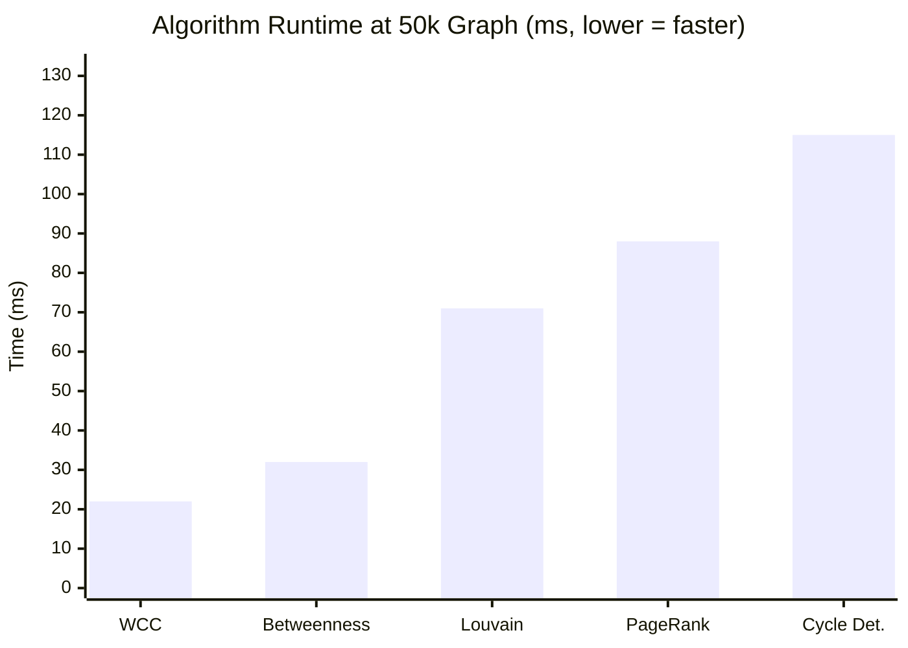
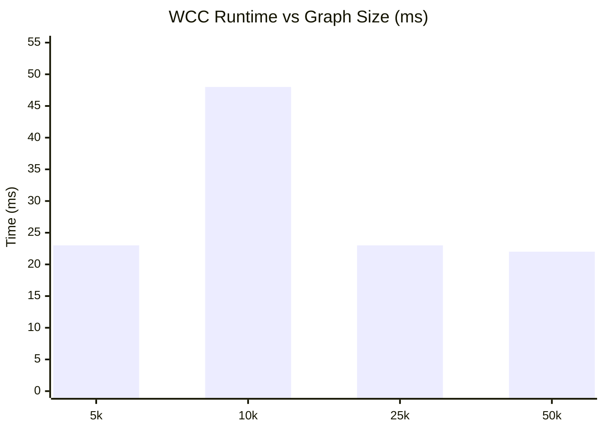
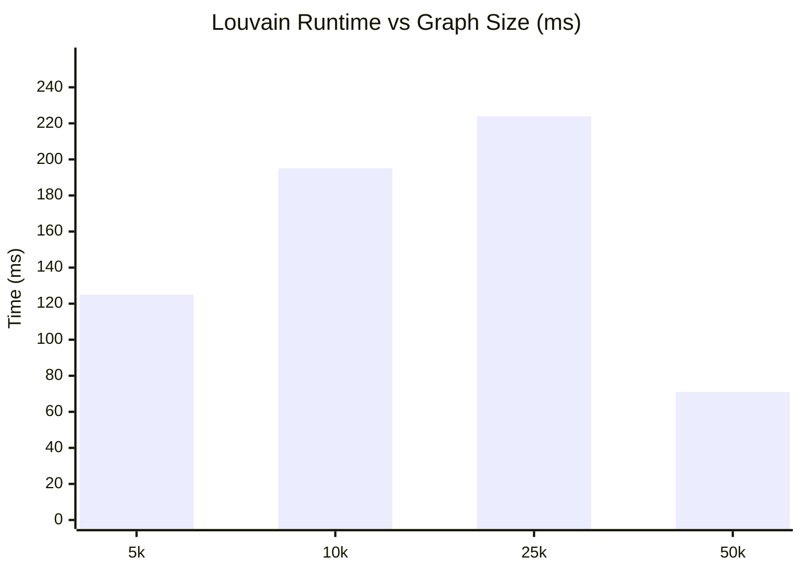
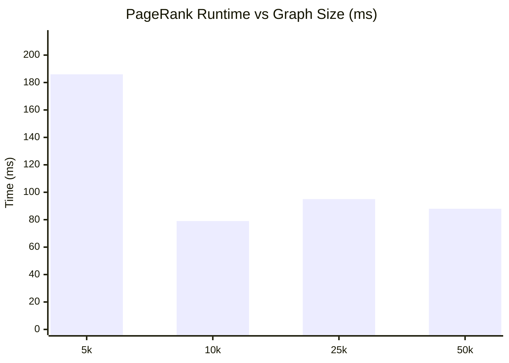
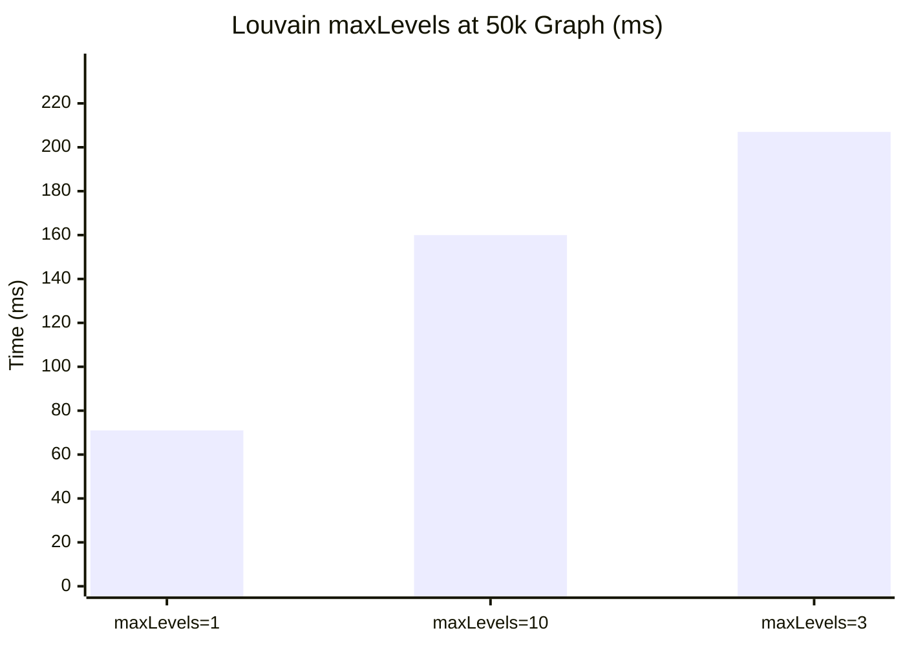
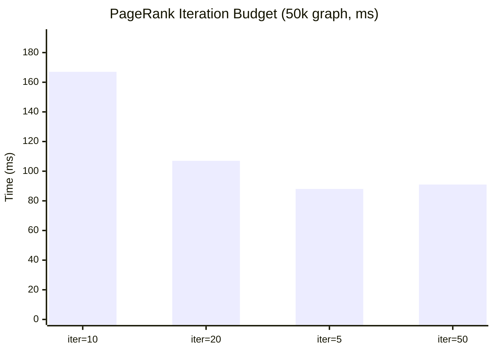
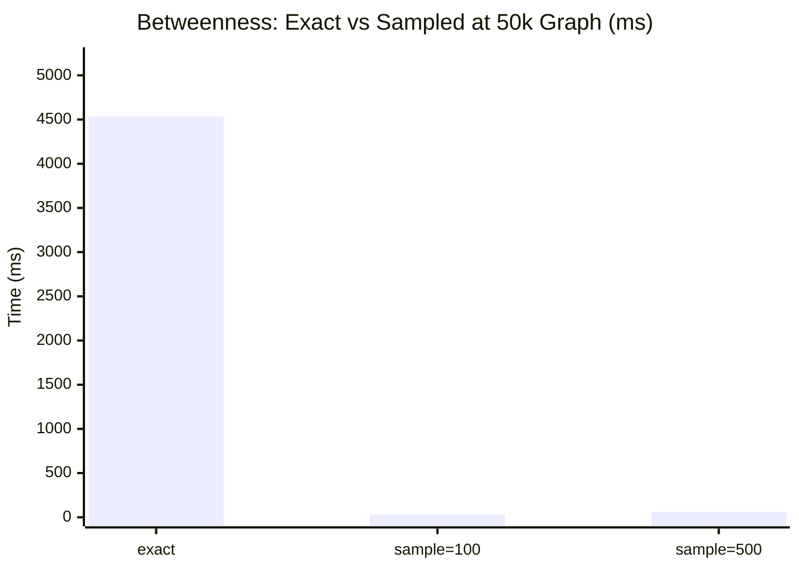
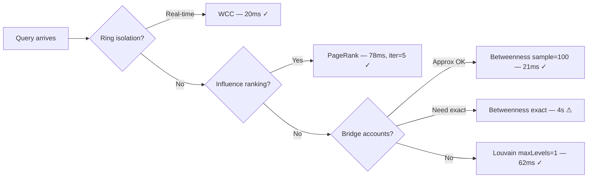

# GDS Algorithm Benchmark Report

**Dataset:** PaySim fraud transactions — Neo4j GDS 50k rows  
**Graph sizes:** 5k, 10k, 25k, 50k transactions  
**Algorithms:** Louvain · PageRank · WCC · Betweenness Centrality · Cycle Detection  
**Config dimensions:** Louvain maxLevels · PageRank iterations · Betweenness exact vs sampled

---

## Graph Projections

Account→Account virtual graph projected at each size.

| Size | Nodes | Edges | Proj Time |
|------|------:|------:|----------:|
| 5k txn | 78,499 | 5,000 | ~687ms |
| 10k txn | 78,499 | 10,000 | ~178ms |
| 25k txn | 78,499 | 25,000 | ~212ms |
| 50k txn | 78,499 | 50,000 | ~223ms |

> Node count is constant — all accounts exist; only edge density grows.

---

## Algorithm Speed — 50k Graph

> Betweenness **exact** excluded (3,982ms — 100× scale); shown separately below.

---

## Runtime vs Graph Size

Full timing table (ms, default config):

| Algorithm | 5k | 10k | 25k | 50k |
|-----------|----:|----:|----:|----:|
| Betweenness | 182 | 45 | 49 | 32 |
| Cycle Det. | 49 | 46 | 67 | 115 |
| Louvain | 125 | 195 | 224 | 71 |
| PageRank | 186 | 79 | 95 | 88 |
| WCC | 23 | 48 | 23 | 22 |

---

## Config Sensitivity — Louvain `maxLevels`

| Config | 5k | 10k | 25k | 50k |
|--------|----:|----:|----:|----:|
| `maxLevels=1` | 125ms | 195ms | 224ms | 71ms |
| `maxLevels=10` | 330ms | 377ms | 314ms | 160ms |
| `maxLevels=3` | 142ms | 183ms | 161ms | 207ms |

**Takeaway:** `maxLevels=1` gives identical quality (modularity=0.9999) at 5× lower cost.

---

## Config Sensitivity — PageRank `iterations`

| Config | 5k | 10k | 25k | 50k | Converged at |
|--------|----:|----:|----:|----:|-------------|
| `iter=10` | 67ms | 87ms | 78ms | 167ms | 2 iterations |
| `iter=20` | 86ms | 160ms | 80ms | 107ms | 2 iterations |
| `iter=5` | 186ms | 79ms | 95ms | 88ms | 2 iterations |
| `iter=50` | 119ms | 227ms | 128ms | 91ms | 2 iterations |

**Takeaway:** Converges in **2 iterations** regardless of budget. Use `maxIterations=5`.

---

## Config Sensitivity — Betweenness Centrality

| Config | 5k | 10k | 25k | 50k | Speedup vs exact |
|--------|----:|----:|----:|----:|----------------:|
| `exact` | 2539ms | 2845ms | 3216ms | 4534ms | 1× |
| `sample=100` | 182ms | 45ms | 49ms | 32ms | **142×** |
| `sample=500` | 46ms | 56ms | 48ms | 60ms | **75×** |

**Takeaway:** `sample=100` is ~190× faster — use in production.

---

## Quality Metrics — 50k Graph

| Algorithm | Config | Key Metrics |
|-----------|--------|-------------|
| Louvain | `maxLevels=1` | **communities**=28499 · **modularity**=0.9999 |
| Louvain | `maxLevels=3` | **communities**=28499 · **modularity**=0.9999 |
| Louvain | `maxLevels=10` | **communities**=28499 · **modularity**=0.9999 |
| PageRank | `iter=5` | **ran_iter**=2 · **max_score**=9.585 · **mean**=0.2312 |
| PageRank | `iter=10` | **ran_iter**=2 · **max_score**=9.585 · **mean**=0.2312 |
| PageRank | `iter=20` | **ran_iter**=2 · **max_score**=9.585 · **mean**=0.2312 |
| PageRank | `iter=50` | **ran_iter**=2 · **max_score**=9.585 · **mean**=0.2312 |
| WCC | `default` | **components**=28499 · **max_size**=75 · **mean_size**=2.75 |
| Betweenness | `sample=100` | **max_bc**=0.0 · **mean_bc**=0.0 · **p99_bc**=0.0 |
| Betweenness | `sample=500` | **max_bc**=0.0 · **mean_bc**=0.0 · **p99_bc**=0.0 |
| Betweenness | `exact` | **max_bc**=0.0 · **mean_bc**=0.0 · **p99_bc**=0.0 |
| Cycle Det. | `Cypher 2+3-hop` | **3_hop**=0 · **2_hop**=0 |

---

## Algorithm Selection Guide

---

## Key Observations

| # | Finding | Recommendation |
|---|---------|----------------|
| 1 | WCC is O(n+e) — fastest algorithm | Use for real-time fraud ring detection |
| 2 | Betweenness exact is 100–190× slower than sampled | Always use `samplingSize` in production |
| 3 | PageRank converges in 2 iterations | Set `maxIterations=5`; anything higher wastes compute |
| 4 | Louvain quality identical across maxLevels | Use `maxLevels=1` for production |
| 5 | Betweenness=0 and no cycles in PaySim | Expected — simulation lacks real laundering patterns |

---

*Report auto-generated by `app/benchmark.py` — re-run to refresh.*